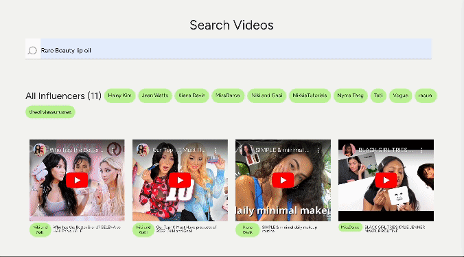

## 👋 Introduction

As an experienced marketing professional in the beauty industry, I've discovered the value of collaborating with influencers who are genuinely enthusiastic about your brand. These influencers often mention your brand organically, making them prime candidates for partnerships. To streamline the process of identifying such influencers, I created an application called "Who Talked About Us" using the [Twelve Labs API](https://docs.twelvelabs.io/docs). This application enables deep contextual video searches, identifying mentions of your brand in YouTube videos, even if your brand isn't explicitly named in titles or descriptions. Let's delve into how you can build a similar app and leverage the Twelve Labs API for influencer identification

📌 Check out the [Demo](https://who-talked-about-us-vercel-client.vercel.app/)! (_Please note: This is a simplified version of the app_)

  

### Built With

- [JavaScript](https://developer.mozilla.org/en-US/docs/Web/JavaScript)
- [Node](https://nodejs.org/en)
- [React](https://react.dev/)
- [React Query](https://tanstack.com/query/latest)
- [React Bootstrap](https://react-bootstrap.netlify.app/)
- [ytdl-core](https://www.npmjs.com/package/ytdl-core)
- [ytpl](https://www.npmjs.com/package/ytpl)
- [React Player](https://www.npmjs.com/package/react-player)