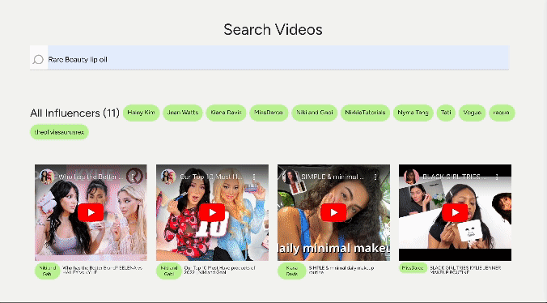

<a id="readme-top"></a>

# Who Talked About Us?

## 👋 Introduction

As an experienced marketing professional in the beauty industry, I've discovered the value of collaborating with influencers who are genuinely enthusiastic about your brand. These influencers often mention your brand organically, making them prime candidates for partnerships. To streamline the process of identifying such influencers, I created an application called "Who Talked About Us" using the [Twelve Labs API](https://docs.twelvelabs.io/docs). This application enables deep contextual video searches, identifying mentions of your brand in YouTube videos, even if your brand isn't explicitly named in titles or descriptions. Let's delve into how you can build a similar app and leverage the Twelve Labs API for influencer identification

📌 Check out the [Demo](https://who-talked-about-us-vercel-client.vercel.app/)! (_Please note: This is a simplified version of the app_)

<div align="center">
  <a href="https://who-talked-about-us-vercel-client.vercel.app/">
    
  </a>
</div>

### Built With

- [JavaScript](https://developer.mozilla.org/en-US/docs/Web/JavaScript)
- [Node](https://nodejs.org/en)
- [React](https://react.dev/)
- [React Query](https://tanstack.com/query/latest)
- [React Bootstrap](https://react-bootstrap.netlify.app/)
- [ytdl-core](https://www.npmjs.com/package/ytdl-core)
- [ytpl](https://www.npmjs.com/package/ytpl)
- [React Player](https://www.npmjs.com/package/react-player)

<p align="right">(<a href="#readme-top">back to top</a>)</p>

## 🔑 Getting Started

### Step 1. Generate Twelve Labs API Key

Visit [Twelve Labs Playground](https://playground.twelvelabs.io/) to generate your API Key

- Upon signing up, you'll receive free credits to index up to 10 hours of video content!

### Step 2 (Option 1). Start the App on Replit

1. Click the button below

   [](https://replit.com/new/github/mrnkim/who-talked-about-us-v2)

2. Add Secrets (equivalent to .env), which is located in the Tools pane

   ```
   REACT_APP_API_KEY=<YOUR API KEY>
   ```

3. Run the Repl

### Step 2 (Option 2). Start the App Locally

1. Clone the current repo

   ```sh
   git clone git@github.com:mrnkim/who-talked-about-us-v2.git
   ```

2. Create `.env` file in the root directory and provide the values for each key

   ```
    REACT_APP_API_KEY=<YOUR API KEY>
    REACT_APP_SERVER_URL=<YOUR SERVER URL> //e.g., http://localhost
    REACT_APP_PORT_NUMBER=<YOUR PORT NUMBER> // e.g., 4000
   ```

3. Start the server

   ```sh
   node server.js
   ```

4. Install and start the client

   ```sh
   npm install
   npm start
   ```

<p align="right">(<a href="#readme-top">back to top</a>)</p>

## 🚘 How to Use

1. Either create a new index or provide an index ID of the existing index that you already created. You can look up the index IDs by [listing indexes](https://docs.twelvelabs.io/v1.2/reference/list-indexes).

   - This app _only_ supports YouTube videos

2. Once you are inside an index, Begin by uploading videos in bulk to the app using either YouTube [playlist ID](https://www.sociablekit.com/find-youtube-playlist-id/#:~:text=Go%20to%20your%20target%20YouTube,playlist%20ID%20is%20PLFs4vir_WsTwEd%2DnJgVJCZPNL3HALHHpF), [channel ID](https://mixedanalytics.com/blog/find-a-youtube-channel-id/), or JSON file.

   - A YouTube playlist and channel should be public
   - The format of a JSON file should follow the below structure

     ```
     [
      { "url": "<VIDEO URL>" },
      { "url": "<VIDEO URL>" }
      ...
     ]
     ```

3. Once the videos are uploaded, you can conduct a search using any keyword. Here are some suggestions:

   - Enter your brand name or product name and discover who's already talking about you in their videos
   - Enter your competitors' brand names to see what types of influencers they're attracting
   - You can also search for very specific or contextual keywords such as "_applying MAC gold highlighter_" or "_holding Gentle Monster sunglasses_"!

4. The search results will be shown grouped by each channel (influencer) and video, displaying moments in videos where your keyword is mentioned or featured.

5. Based on these results, you can prioritize influencers and begin your outreach efforts!

<p align="right">(<a href="#readme-top">back to top</a>)</p>

## 🎯 What is Next?

- Add more tests
- Improve error handling and add data validations
